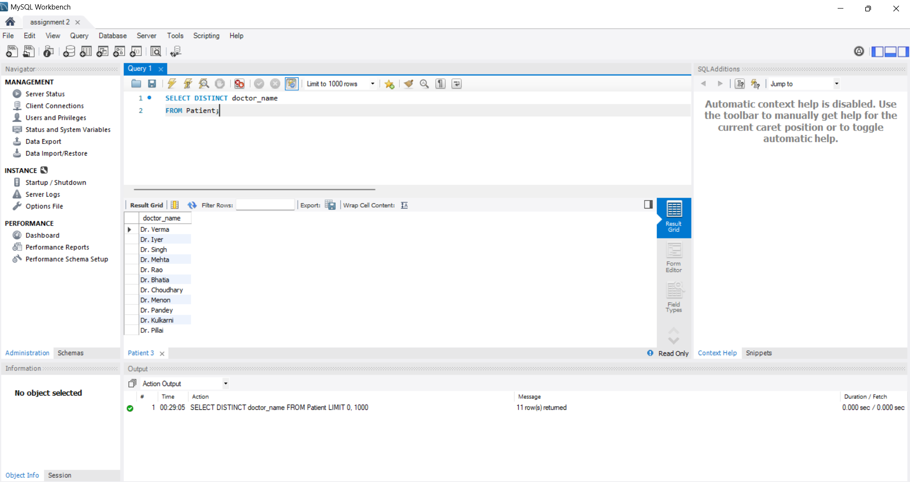

# SQL Practical Assignment 2

## Create database and perform all basic queries.

- **To Create Database** (CREATE & USE Query)

  `CREATE DATABASE Hospitals;`
  
  `USE Hospitals;`
  
  `CREATE TABLE Patient (
    patient_id INT PRIMARY KEY AUTO_INCREMENT,
    patient_name VARCHAR(50),
    doctor_name VARCHAR(50),
    diagnose VARCHAR(100),
    phone_no VARCHAR(15),
    admit_date DATE,
    discharge_date DATE,
    age INT,
    gender CHAR(1),
    address VARCHAR(100)
);`
  
  
  *Output:*

  

---

- **DROP Query**

  `DROP TABLE Patient;`
  
  *Output:*
  
  

---
  
- **INSERT Query**

  `INSERT INTO Patient (patient_name, doctor_name, diagnose, phone_no, admit_date, discharge_date, age, gender, address) 
VALUES 
('John Doe', 'Dr. Smith', 'Flu', '123-456-7890', '2024-01-05', '2024-01-10', 30, 'M', '123 Main St'),
('Jane Roe', 'Dr. Adams', 'Pneumonia', '321-654-0987', '2024-01-12', '2024-01-18', 45, 'F', '456 Elm St'),
('Alice Blue', 'Dr. Clark', 'Bronchitis', '987-654-3210', '2024-02-05', '2024-02-14', 50, 'F', '789 Oak St'),
('Bob Green', 'Dr. Smith', 'COVID-19', '789-123-4567', '2024-02-10', NULL, 28, 'M', '159 Maple St'),
('Carol White', 'Dr. Adams', 'Asthma', '654-987-1234', '2024-03-01', '2024-03-10', 36, 'F', '246 Pine St'),
('Eve Black', 'Dr. Clark', 'Heart Disease', '123-654-7890', '2024-03-05', '2024-03-15', 52, 'F', '369 Cedar St'),
('George Brown', 'Dr. Smith', 'Diabetes', '987-321-6540', '2024-04-10', '2024-04-20', 44, 'M', '951 Maple St'),
('Hannah Gray', 'Dr. Adams', 'Hypertension', '321-123-4567', '2024-05-01', NULL, 62, 'F', '123 Oak Ave'),
('Ivy Gold', 'Dr. Clark', 'Arthritis', '555-123-7890', '2024-05-15', '2024-05-25', 58, 'F', '456 Birch St'),
('Jack White', 'Dr. Smith', 'Migraine', '789-654-3210', '2024-06-01', '2024-06-07', 29, 'M', '789 Maple St'),
('Kelly Silver', 'Dr. Adams', 'Anxiety', '654-789-1234', '2024-06-10', '2024-06-20', 33, 'F', '951 Elm St'),
('Liam Blue', 'Dr. Clark', 'Back Pain', '123-321-4567', '2024-07-05', '2024-07-12', 40, 'M', '159 Cedar Ave');`
  
  
  
  *Output:*
  
  

---

- **SELECT Query**

  `SELECT * FROM patient;`
  
  *Output:*
  
  

---

- **UPDATE & WHERE Query**

  `UPDATE Patient 
SET phone_no = '9123456781' 
WHERE patient_id = '3';`
  
  *Output:*
  
  

---

- **ALTER Query**

  `ALTER TABLE Patient 
RENAME COLUMN address TO home_address;`
  
  *Output:*
  
  

---

- **ORDER BY Query**

  `SELECT * FROM Patient 
ORDER BY discharge_date DESC;`
  
  *Output:*
  
  

---

- **Inner Join Query**

  `SELECT Patient.patient_name, Appointment.appointment_date, Appointment.purpose
FROM Patient
INNER JOIN Appointment ON Patient.patient_id = Appointment.patient_id;`  
  
  *Output:*
  
  
---

- **Left Join Query**

  `SELECT Patient.patient_name, Appointment.appointment_date, Appointment.purpose
FROM Patient
LEFT JOIN Appointment ON Patient.patient_id = Appointment.patient_id;`
  
  *Output:*
  
  

---

- **Right Join Query**

  `SELECT Appointment.appointment_id, Patient.patient_name, Appointment.appointment_date, Appointment.purpose
FROM Patient
RIGHT JOIN Appointment ON Patient.patient_id = Appointment.patient_id;`

  *Output:*
  
  

---

- **Full Outer-Join Query**

  `SELECT Patient.patient_name, Appointment.appointment_id, Appointment.appointment_date, Appointment.purpose
FROM Patient
LEFT JOIN Appointment ON Patient.patient_id = Appointment.patient_id
UNION
SELECT Patient.patient_name, Appointment.appointment_id, Appointment.appointment_date, Appointment.purpose
FROM Patient
RIGHT JOIN Appointment ON Patient.patient_id = Appointment.patient_id;`
 
  
  *Output:*
  
  
  **Distinct Query**

 ` SELECT DISTINCT subject_`

 `FROM students;`

  *Output:*
  
  
